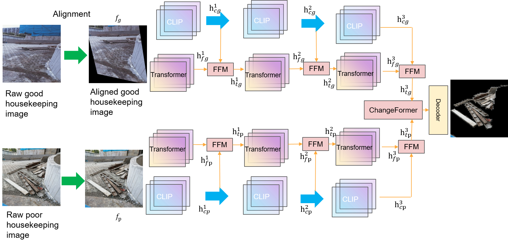
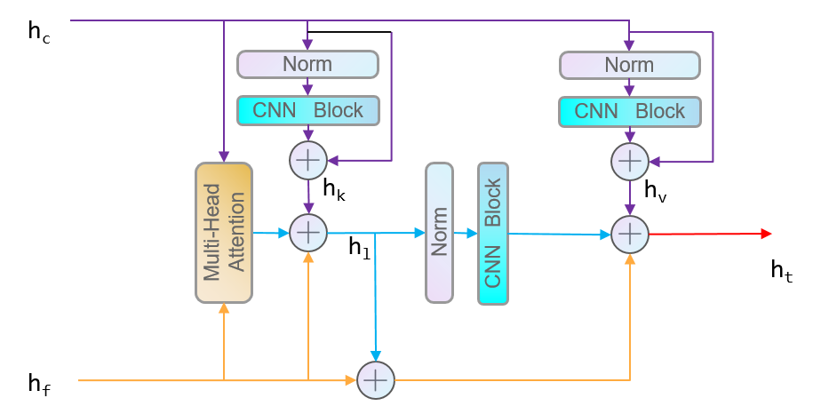

# Code for A Change Detection Network and Dataset for Housekeeping in Construction Sites


 

 
 

 


## Install


Please refer [Install](https://github.com/likyoo/open-cd/blob/main/docs/inference.md) doc.
Or refer to Install [opencd](https://github.com/likyoo/open-cd).


## Usage

#### Prepare pretrain models

Create a new folder named pretrain, then download and store the [pretrained](https://huggingface.co/likyoo/BAN/blob/main/pretrain/clip_vit-large-patch14-336_3rdparty-0b5df9cb.pth) model. 
Download our best [trained](https://mynbox.nus.edu.sg/u/sJf-0POX_vqil_7r/aa885dbe-f834-428f-b8ae-3854991eb4c2?l) model.

#### Test
```
# get metrics
python tools/test.py configs/hcdn/hcdn_vit-l14-clip_mit-b2_512x512_40k_levircd.py ./best.pth

# get .png results
python tools/test.py configs/hcdn/hcdn_vit-l14-clip_mit-b2_512x512_40k_levircd.py ./best.pth --show-dir images
```

You will get the following results:
```
+-----------+--------+-----------+--------+-------+-------+
|   Class   | Fscore | Precision | Recall |  IoU  |  Acc  |
+-----------+--------+-----------+--------+-------+-------+
| unchanged | 92.61  |   93.84   | 91.41  | 86.24 | 91.41 |
|  changed  | 80.73  |   78.06   | 83.59  | 67.69 | 83.59 |
+-----------+--------+-----------+--------+-------+-------+
- mmengine - INFO - Iter(test) [70/70]    aAcc: 89.3200  mFscore: 86.6700  mPrecision: 85.9500  mRecall: 87.5000  mIoU: 76.9700  mAcc: 87.5000  
```


#### Train 💥💥💥
```
python tools/train.py configs/hcdn/hcdn_vit-l14-clip_mit-b2_512x512_40k_levircd.py --work-dir ./hcdn_workdir
```
You will get the following results like:
```
+-----------+--------+-----------+--------+-------+-------+
|   Class   | Fscore | Precision | Recall |  IoU  |  Acc  |
+-----------+--------+-----------+--------+-------+-------+
| unchanged | 91.46  |   92.33   | 90.61  | 84.27 | 90.61 |
|  changed  | 81.14  |   79.49   | 82.86  | 68.27 | 82.86 |
+-----------+--------+-----------+--------+-------+-------+
 - mmengine - INFO - Iter(val) [141/141]    aAcc: 88.2500  mFscore: 86.3000  mPrecision: 85.9100  mRecall: 86.7400  mIoU: 76.2700  mAcc: 86.7400  data_time: 0.0051  time: 0.6723
```


## Contact Us

If you have other questions❓, please contact us in time 👬
